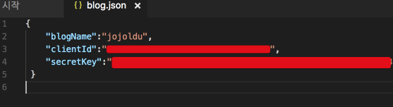
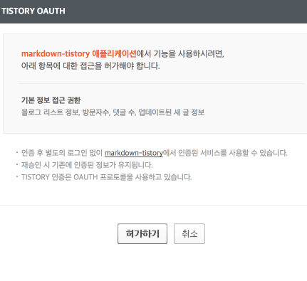
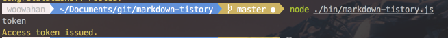
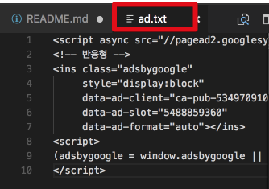
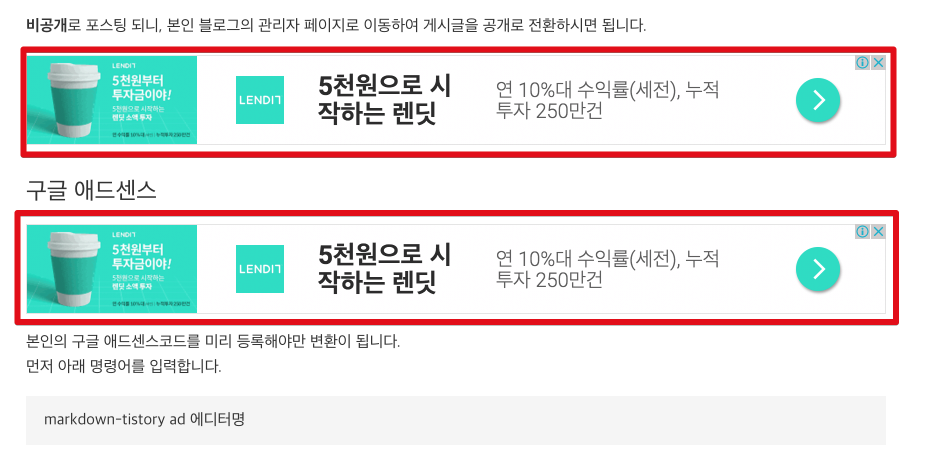

# markdown-tistory 

[]()
[]()

PC에 작성된 마크다운 파일을 티스토리 OAuth API를 통해 HTML(+구글 애드센스)로 변환하여 포스팅해주는 스크립트


## Install

현재 nodejs **6.9.2** 버전에서 개발되어있기에 6.x 버전 이상을 사용하길 권장드립니다.  
  
  
기존의 npm 패키지 설치와 동일하게 아래와 같은 커맨드로 설치가 가능합니다.

```
npm install -g markdown-tistory
```

## Usage

기본적으로 OAuth 키가 발급 되어야 사용 가능합니다.  
**가장 먼저 키 발급**을 해주세요

### 키 발급

먼저 [티스토리 API](http://www.tistory.com/guide/api/oauth)로 이동하여 임시 클라이언트를 등록합니다.


등록후 발급되는 client id와 secret key를 사용할 예정이니 메모장에 복사하시고


명령 프롬프트(윈도우), 터미널(맥/리눅스)을 열어 ```markdown-tistory init 에디터``` 명령어를 입력하여, 값을 등록합니다.  
  
아래중 하나의 에디터는 설치되어 있어야 합니다.

* sublime
  * Sublime Text
* atom 
  * Atom Editor
* code
  * Visual Studio Code
* vim 
* emacs

PC에 설치된 에디터의 종류에 따라 입력하시면 됩니다.  
  
Ex)

```
markdown-tistory init code
```

오픈된 파일에는 다음과 같은 값을 등록하시면 됩니다.



* blog name : 본인의 블로그 주소 (ex: jojoldu.tistory.com의 jojoldu를 입력하시면 됩니다.)
* client id : API에 등록한 client id
* secret key : API에 등록한 secret key

해당 파일 저장후, AccessToken을 발급 받겠습니다.  
아래의 명령어를 입력합니다.

```
markdow-tistroy token
```

브라우저가 열려 다음과 같이 OAuth2 인증이 등장합니다.



허가하기를 클릭하시면 터미널에 다음과 같이 성공 메세지가 출력됩니다.



이제 인증키는 모두 발급 받았습니다.  
  
> 티스토리 AccessToken은 **1개월의 유효기간**을 갖고 있습니다.  
한달이 지나서 키가 만료되었다는 메세지가 보이면 다시 키를 발급(```markdown-tistory token```) 받으시면 됩니다.


### 포스팅

마크다운 파일 **위치를 지정하면** 지정된 위치의 해당 파일을,  
**위치를 지정하지 않으면 현재 위치**에서 해당 파일을 찾아 포스팅합니다.  

1. 현재 위치의 마크다운 파일

```
markdown-tistory write
```

2. 절대주소로 마크다운 파일 지정

```
markdown-tistory write /Users/woowahan/Documents/git/markdown-tistory/README.md

```

3. 현재 터미널 위치의 상대주소로 마크다운 파일 지정

```
markdown-tistory write ./README.md
```

**비공개**로 포스팅 되니, 본인 블로그의 관리자 페이지로 이동하여 게시글을 공개로 전환하시면 됩니다.

### 블로그 정보 수정

이미 만들어진 blog.json 정보를 수정하고 싶다면 아래의 명령어를 사용하시면 됩니다.

```
markdown-tistory show 에디터종류
```

생성된 blog.json이 지정한 에디터에 오픈됩니다.

### 구글 애드센스

본인의 구글 애드센스코드를 미리 등록해야만 변환이 됩니다.  
먼저 아래 명령어를 입력합니다.

```
markdown-tistory ad 에디터명
```

```ad.txt```파일이 하나 생성되어 에디터로 표시됩니다.  
아래처럼 본인의 애드센스 코드를 입력합니다.



저장후, 마크다운 파일 본문에 ```[[ad]]``` 를 추가하면 포스팅시에 자동으로 구글광고가 해당 영역에 추가됩니다.

마크다운 작성


티스토리 반영



> 아직 구글 애드센스 계정이 없으시다면 [링크](http://superfelix.tistory.com/78)를 참고하여 가입해주세요.  

## Precautions

* 문장의 **첫 글자에 코드 문법이 있으면 파싱 에러**가 발생합니다.
  * 띄어쓰기 한번을 해주세요

* ```sudo```를 통해 명령어를 실행하면 이후 에디어터에서 저장이 안됩니다
  * ```init```, ```token```등 에디터를 통해 수정하는 기능들은 ```sudo``` 없이 실행해주세요

* 게시글의 제목은 **마크다운 파일명**을 기준으로 합니다.


## Release Note

* 0.1.2
  * 파일명만 입력할 경우 현재 위치로 이미지 경로 인식못하는 버그 수정

* 0.1.1
  * 구글 애드센스 자동 추가

* 0.1.0
  * 전체코드 리팩토링
    * 콜백 -> Promise
    * Mocha 테스트 코드 추가
    * 도메인 Layer 분리
  
  * 마크다운 파일명으로 작성하기 기능 추가
    * 마크다운 파일명을 ```write```와 함께 입력하면 해당 마크다운 파일을 티스토리에 작성
  
  * 이미지 상대경로외에 절대경로 검색 기능 추가
    * 기존에 마크다운 파일 위치를 기준으로만 가능했던 이미지 등록이 절대주소도 가능하도록 수정
       
  * 마크다운 CSS 적용 스크립트 제거
    * 해당 스크립트로 인해 RSS가 깨짐
    * 티스토리에 직접 CSS 파일 추가하기를 권장
    
* 0.0.8
  - **별도의 css** 추가없이 마크다운 스타일 적용
  - blog.json & token.json 홈 디렉토리에 생성 및 읽기로 변경 (업데이트시마다 init 했던 점 수정)

* 0.0.7
  - 오타수정 (secrete -> secret)

* 0.0.6
  - multi markdown의 테이블 문법 적용
  - 텍스트 내부에 code 블럭 문법 오류 수정

* 0.0.5
  - 컬러 console 효과
  - http, https 등의 이미지 주소는 컨버팅 대상에서 제외
  - 이미지 주소 찾지 못하는 경우 해당 이미지 제외하고 다음 프로세스 진행되도록 기능 수정

* 0.0.4
  - 기본기능 및 npm 등록
   

## TO DO

* 타이틀, 공개설정여부, 카테고리 등 상세 포스팅 설정 추가
* 등록된 게시글 마크다운 파일로 다운로드 기능
* 등록된 게시글 수정 기능
* 이글루스 블로그 추가

## 참고
* [티스토리 API](http://www.tistory.com/guide/api/post)
* [Nodejs Path 가이드](https://nodejs.org/api/path.html#path_windows_vs_posix)
* [Node form-data](https://github.com/form-data/form-data)
* [Promise](https://developer.mozilla.org/ko/docs/Web/JavaScript/Reference/Global_Objects/Promise)
* [Global Module 생성](https://bretkikehara.wordpress.com/2013/05/02/nodejs-creating-your-first-global-module/)

