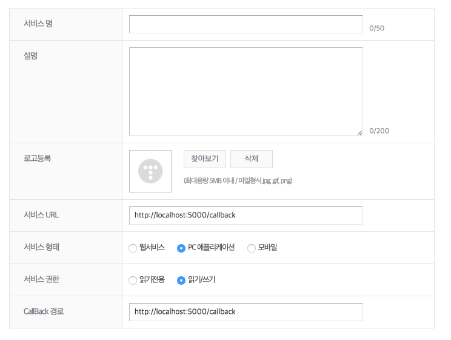

# 마크다운으로 작성한 내용을 티스토리로 전송하기
PC에 작성된 마크다운 파일을 티스토리 Oauth API를 통해 HTML로 변환된 내용을 포스팅해주는 스크립트


### 버전별 변경사항

* 0.4.0 : 기본기능 및 npm 등록
* 0.5.0
  - 컬러 console 효과
  - http, https 등의 이미지 주소는 컨버팅 대상에서 제외
  - 이미지 주소 찾지 못하는 경우 해당 이미지 제외하고 다음 프로세스 진행되도록 기능 수정
  

### 설치
현재 nodejs **6.9.2** 버전에서 개발되어있기에 하위 버전에서의 호환성은 테스트하지 못한 상태이다

기존의 npm 패키지 설치와 동일하게 아래와 같은 커맨드로 설치가 가능하다.
```
npm install -g markdown-tistory
```

설치 후에는 [티스토리 API](http://www.tistory.com/guide/api/oauth)에 임시 클라이언트 등록한다


등록후 발급되는 client id와 secret key를 사용할 예정이니 메모장에 복사


명령 프롬프트(윈도우), 터미널(맥/리눅스)을 열어 ```markdown-tistory init``` 명령어를 입력하여, 안내대로 값을 입력한다
* blog name : 본인의 블로그 주소 (ex: jojoldu.tistory.com의 jojoldu)
* client id : API에 등록한 client id
* secret key : API에 등록한 secret key

위 작업은 access token을 발급 받기 위한 작업으로, 처음 **1번만** 입력하면 된다.
이후부터는 아래의 작업만 진행하면 된다.

### 사용
작성된 마크다운 파일이 있는 위치에서 명령 프롬프트(윈도우), 터미널(맥/리눅스)를 열어 아래 명령어 입력
```
markdown-tistory write
```

등록이 성공하면 해당 내용은 **비공개**로 포스팅 되니, 본인 블로그의 관리자 페이지로 이동하여 게시글을 공개로 전환한다.

### 주의사항
* 마크다운에서 사용되는 이미지 위치는 마크다운 파일을 기준으로 작성되어야 한다.

**Good**
```

```

**Bad**
```

```

* 게시글의 제목은 **마크다운 파일명**을 기준으로 한다.
* ```write```명령어를 실행시키는 폴더에선 하나의 마크다운 파일만 포스팅 된다.


### 업데이트 예정
* 등록된 게시글 마크다운 파일로 다운로드 기능
* 등록된 게시글 수정 기능

### 참고
* [티스토리 API](http://www.tistory.com/guide/api/post)
* [Nodejs Path 가이드](https://nodejs.org/api/path.html#path_windows_vs_posix)
* [Node form-data](https://github.com/form-data/form-data)
* [Promise](https://developer.mozilla.org/ko/docs/Web/JavaScript/Reference/Global_Objects/Promise)
* [Global Module 생성](https://bretkikehara.wordpress.com/2013/05/02/nodejs-creating-your-first-global-module/)