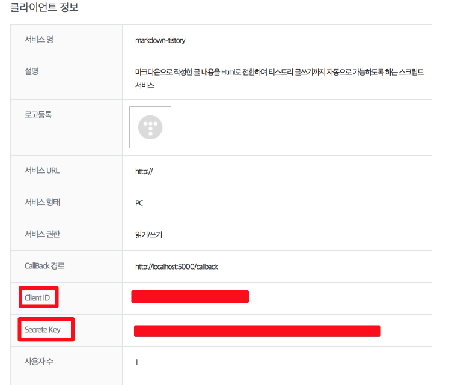

# Java (2/6) 

## 4장

## 5장 배열 (2/2)

### 5.6.4 배열의 초기값


| Tables        | Are           | Cool  |
| ------------- |:-------------:| -----:|
| col 3 is      | right-aligned | $1600 |
| col 2 is      | centered      |   $12 |
| zebra stripes | are neat      |    $1 |


명령 프롬프트(윈도우), 터미널(맥/리눅스)을 열어 ```markdown-tistory init``` 명령어를 입력하여, 안내대로 값을 입력합니다.
* blog name : 본인의 블로그 주소 (ex: jojoldu.tistory.com의 jojoldu를 입력하시면 됩니다.)
  * 들여쓰기1
    * 들여쓰기1
* client id : API에 등록한 client id
  * 들여쓰기2
    * 들여쓰기2
* secret key : API에 등록한 secret key
  * 들여쓰기3
    * 들여쓰기3
    
위 작업은 access token을 발급 받기 위한 작업으로, 처음 **1번만** 입력하면 된다. (한달 만료기간 있음. 1달에 1번 갱신은 필요)
이후부터는 아래의 작업만 진행하면 된다.

### 사용

작성된 마크다운 파일이 있는 위치에서 명령 프롬프트(윈도우), 터미널(맥/리눅스)를 열어 아래 명령어 입력
```
markdown-tistory write markdown-tistory write markdown-tistory write markdown-tistory write markdown-tistory write markdown-tistory write markdown-tistory write markdown-tistory write
```

등록이 성공하면 해당 내용은 **비공개**로 포스팅 되니, 본인 블로그의 관리자 페이지로 이동하여 게시글을 공개로 전환한다.

### 이미지 테스트





